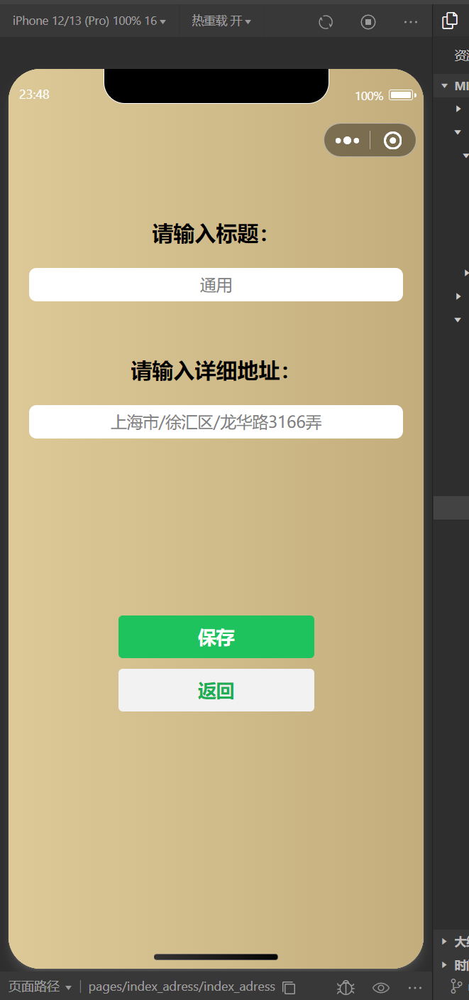

## 微信小程序：随申码

随申码是目前开发、优化较为成熟的一款小程序app。
其在近两年的大规模测试中运行稳定，且在UI设计、并发性能、功能实现等方面可圈可点。
在各省份的健康码程序中也是独树一帜的一款产品。

本仓库代码仅供热爱小程序开发的小伙伴们参考交流。

如若用于非法用途，本人保留依法追责的权利。

## 说明

使用本代码进行开发需要申请appid, 然后将其替换掉代码中的“xxxxx”:

## Show

